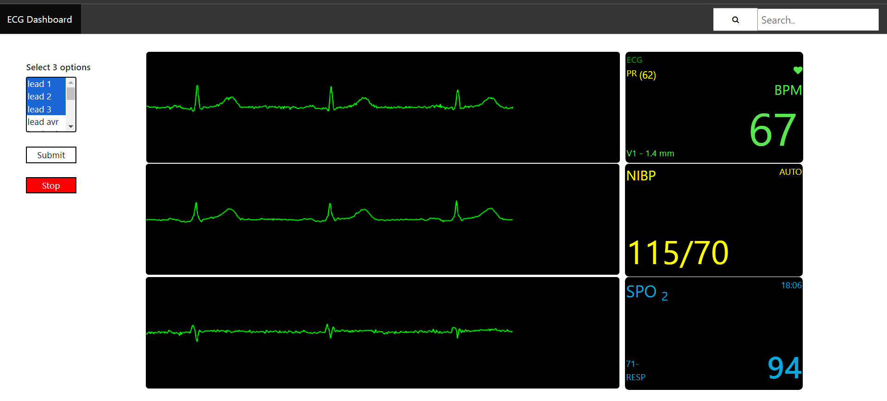

# ECG Dashboard

The ECG Dashboard offers a state-of-the-art solution for detecting cardiac abnormalities in real-time. It continuously monitors and analyzes the patient's heart activity, providing valuable insights on rhythm, heartbeat, and other significant parameters.

  
*Screenshot of the ECG Dashboard*

## Features

- **Real-time Visualization**: Display of ECG data for immediate insights.
- **Early Detection**: Identifies conditions such as myocardial infarction, arrhythmia, and other cardiovascular diseases.
- **Selectable Lead Options**: Tailor your viewing preferences by choosing specific leads.
- **Integrated Backend**: Powered by a Flask server integrated with a comprehensive ECG database.
- **Intuitive Interface**: A front-end design optimized for healthcare professionals.

## Technology Stack

- **Frontend**: Crafted with HTML, CSS, and JavaScript.
- **Backend**: Driven by Flask (a Python web framework) and enriched with libraries like NumPy and WFDB for precise ECG data extraction and visualization.
- **Data Source**: Leverages a 12-lead ECG database from the PhysioNet website.

## Prerequisites

- Python (>=3.6)
- pip
- A modern web browser

## Setup and Installation

### Back-End

1. **Install Python**: Download and install Python from the [official website](https://www.python.org/downloads/).
   
2. **Install Required Python Packages**: Execute the following command:
   ```bash
   pip install flask wfdb numpy flask_cors

Front-End
Option 1: Using VS Code's Live Server
Open the project folder in VS Code.
Install the Live Server extension.
Right-click on index.html and select "Open with Live Server".
Option 2: Using a Web Browser
Navigate to the project directory and double-click on index.html.

Note: Ensure associated resources, like function.js and style.css, reside in the same directory as index.html.

Usage
Run the backend Flask server.
Launch the ECG Dashboard in your preferred browser.
Select the ECG leads of interest from the dropdown menu.
Click "Submit" to visualize the ECG graphs.
Contributing
We welcome contributions! For major changes or enhancements, please open an issue first to discuss your proposed updates.
